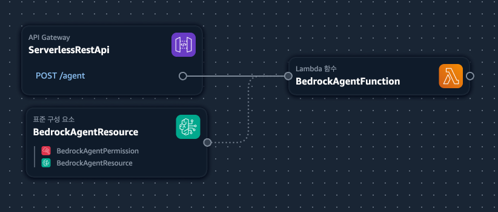

# Bedrock Agent Sample with SAM

This project demonstrates how to create an Amazon Bedrock Agent using AWS Serverless Application Model (SAM). The agent provides information about AWS services using a Lambda function as the action group executor.

## Architecture



The project includes:
- Amazon Bedrock Agent with a custom action group
- AWS Lambda function to process agent requests
- Amazon API Gateway to expose the Lambda function
- IAM roles and permissions for secure access

## Prerequisites

- AWS CLI installed and configured
- AWS SAM CLI installed
- Python 3.11 or later
- An AWS account with access to Amazon Bedrock

## Setup

1. Clone this repository
2. Build the application:
   ```
   sam build
   ```
3. Deploy the application:
   ```
   sam deploy --guided
   ```
4. Follow the prompts to deploy the application

## How It Works

1. The SAM template (`template.yaml`) defines the infrastructure:
   - Lambda function
   - API Gateway
   - Bedrock Agent
   - IAM roles and permissions

2. The Lambda function (`src/app.py`) processes requests from the Bedrock Agent:
   - Receives requests from the agent
   - Extracts parameters
   - Calls the Bedrock runtime to get information about AWS services
   - Returns the response to the agent

3. The OpenAPI schema (`openapi-schema.json`) defines the action group API:
   - Endpoints
   - Request/response formats
   - Parameters

## Testing

You can test the agent using the AWS Console:
1. Go to the Amazon Bedrock console
2. Navigate to Agents
3. Find the deployed agent (SampleAgent)
4. Use the Test window to interact with the agent
5. Ask questions about AWS services, e.g., "Tell me about Amazon S3"

## Cleanup

To remove all resources created by this project:
```
sam delete
```

## License

This project is licensed under the MIT License - see the LICENSE file for details.